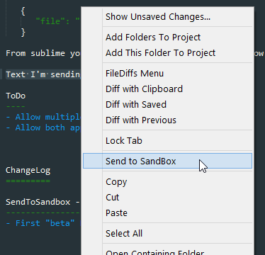
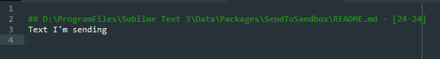

Send to Sandbox
===============
The idea of this plugin is to use a file as a _SandBox_. A file to which you send "stuff" you want remember or just you wanna store
somewhere rapidly. Somewhere like a clipboard but more consisent.
Right now you can (and must) just specify a single file in the \ProgramFiles\Sublime Text 3\Data\Packages\User\SendToSandbox.sublime-settings file.

In this file, once you've sent something to it, you'll find all your texts, with a "title" (in markdown style) that is the name of the file where those lines were originally. At the end of the filename you'll find the line-numbers of the original lines.

This is a test version, just to understand if someone needs it. I need it, and if I'm not the only one I'll improve it.
Feel free to send me advise or anything to davidgerva@gmail.com

Usage
-----
Just decide the file you want to use as sandbox and put it in the SendToSandbox.sublime-settings file, for example:

    {
       "file": "c:\\Temp\\SublimeSandbox.txt"
    }

From sublime you can now select text from any window and send this text to your sandbox using a right mouse button click, Send to sandbox.

ToDo
----
- Allow multiple file specification
- Allow both append and insert in the file
- Add a command to open the sandbox in sublime
- Add a shortcut to the sendtosandbox command

ChangeLog
=========

SendToSandbox - 1.0.0
---------------------
- First "test" Release
